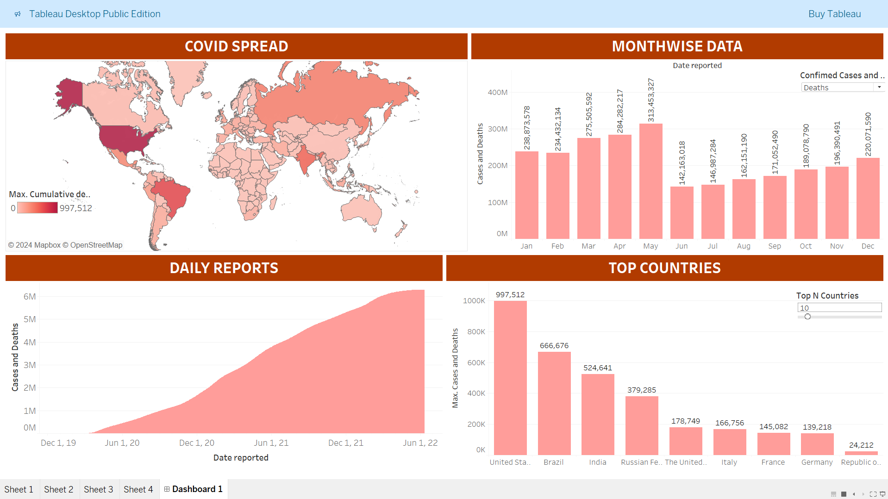

# Covid_19_Report
A Tableau-based COVID-19 spread analysis and visualization project, showcasing global case trends, top affected countries, and monthly reports.

# COVID-19 Dashboard Analysis (2019-2022)

## Project Overview
This project showcases a **Tableau dashboard** analyzing the global spread of COVID-19 from its onset in 2019 to 2022. Using data visualization, this project highlights critical insights about case and death trends, top affected countries, and monthly progression.

Preview of the Dashboard

---

## Key Features of the Dashboard
1. **COVID Spread (Map View)**:
   - A world map visualizing the cumulative deaths across countries, with darker shades indicating higher fatalities.
   - Dynamic scaling to highlight the most impacted regions.

2. **Monthwise Data**:
   - A bar chart showing confirmed cases and deaths for each month.
   - The chart enables clear comparisons of how the pandemic evolved over time.

3. **Daily Reports**:
   - An area chart visualizing the cumulative number of cases and deaths from December 2019 to Mid-2022.
   - The trend shows the rapid rise in cases during peak waves.

4. **Top Countries**:
   - A bar chart showcasing the top N countries with the highest reported deaths.
   - An interactive slider allows users to adjust the number of countries displayed dynamically.

---

## Skills Demonstrated
### 1. **Data Analytics**
- **Data Preparation**:
  - Cleaned and preprocessed raw COVID-19 data from trusted source.
  - Aggregated data for monthly trends and regional breakdowns.

- **Insights Extraction**:
  - Highlighted top-performing metrics such as monthly cases, cumulative deaths, and country-wise fatalities.

### 2. **Data Visualization with Tableau**
- **Interactive Filters**:
  - Incorporated a country slider for the top N countries to customize visual insights.
  - Added dynamic filters for switching between confirmed cases and deaths.

- **Effective Chart Selection**:
  - Used a world map for geographical insights.
  - Combined bar and area charts to show temporal trends and cumulative statistics.

- **Dashboard Layout**:
  - Organized visuals into clearly defined sections: Map, Monthly Data, Daily Reports, and Top Countries.
  - Applied color gradients to highlight trends (e.g., darker shades for higher fatalities).

---

## Tools and Technologies
- **Tableau**: For creating the dashboard and data visualizations.
- **Microsoft Excel / CSV**: For data cleaning and transformation.
- **GitHub**: To host and showcase the project.

---

## How to View the Dashboard
1. [View the published dashboard on Tableau Public/Desktop](https://public.tableau.com/views/Covid_19_17340017037410/Dashboard1?:language=en-US&:sid=&:redirect=auth&:display_count=n&:origin=viz_share_link)
2. Download the Tableau workbook file (`Dashboard/Covid_19_Analysis.twb`) from this repository and open it using Tableau Desktop/Public.

---

## Future Enhancements
1. **Trend Predictions**:
   - Incorporate predictive analytics to forecast case and death trends.
2. **Vaccination Data**:
   - Add insights on vaccination progress by country and region.
3. **Country Comparisons**:
   - Enable comparisons between countries on a year-over-year basis.

---

Feel free to explore the repository and share your feedback!

